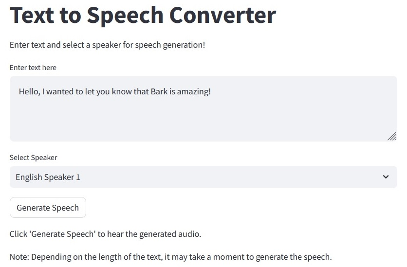
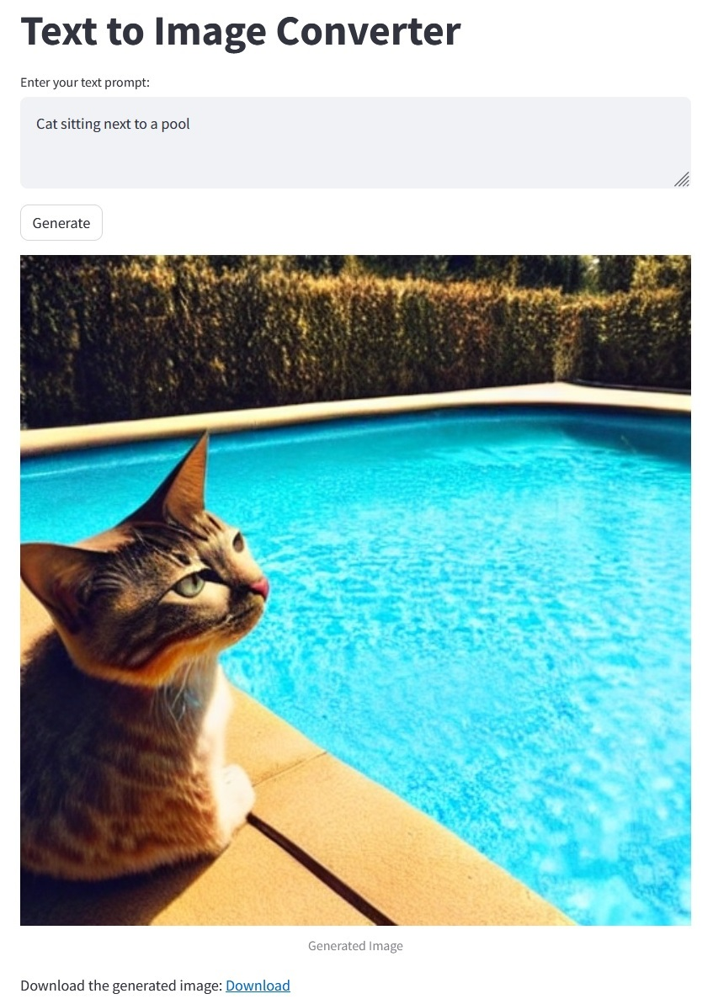
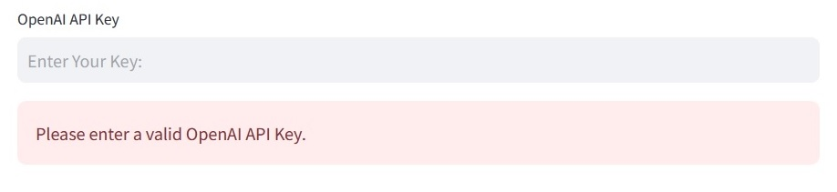

## **Streamlit Apps**

#### This repository includes three applications deployed using Streamlit.

### **Text to Image App**

The [Stable Diffusion](https://github.com/Stability-AI/stablediffusion) model is utilized for high-resolution image synthesis using CUDA.

Please note that Streamlit cloud environment currently does not support NVIDIA GPU.

### **Text to Speech App**

The [Bark](https://github.com/suno-ai/bark) model is utilized to build a text-to-audio application, featuring highly realistic, multilingual speech as well as other audio, including music, background noise and simple sound effects.

### **Chat AI App**

The [LangChain](https://github.com/langchain-ai/langchain) framework is employed for constructing a LLM-powered application.

